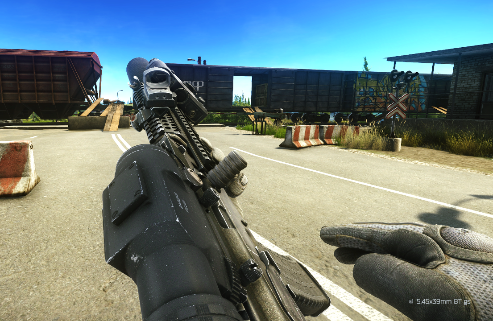
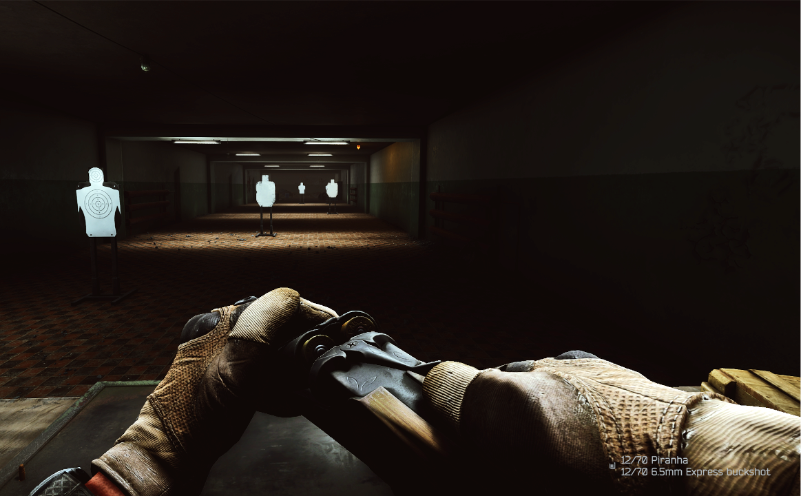

# Chamber Ammo Info

## 📜 Description

**Chamber Ammo Info** is a mod for *Single Player Tarkov* that shows the ammo type loaded in the chamber when performing a chamber check.

## ✨ Features

* Displays the ammo type when performing a chamber check
* Supports multi-chamber, no-chamber weapons and underbarrel grenade launchers
* Integrates seamlessly into Tarkov’s existing UI

## 📁 Installation

* Download the latest release
* Copy the `BepInEx` folder into your SPT folder
* Start the game

## 📷 Preview

 

## 📄 License

Distributed under the MIT License. See `LICENSE` for more information.
